 

## 👋 About me

<!--  -->

I began my career in accounting and finance, working as a Chartered Accountant, before moving into data science to deepen my analytical and technical skill set. That led me to a *Master of Applied Data Science*, and from there into geospatial development, building data engineering solutions and interactive tools for infrastructure planning and research. Along the way, that work pulled me further into software development, and I'm now studying part time towards a *Master of Applied Computing* to build on that foundation.

What's stayed consistent throughout is an interest in raw, complex, and messy data, whether it's financial records, environmental data, or spatial datasets, and turning it into something reliable and useful. I enjoy cleaning and structuring data, building and automating data pipelines, working across databases, and developing models, dashboards, and reports that hold up under scrutiny. The goal is always the same: **make the data work harder**, so the people relying on it can make better decisions with less effort.

🗣️ English & Chinese Mandarin 📍 Christchurch, New Zealand

 

## 🛠️ Tech stack

<table width="100%">
  <tr>
    <td width="50%" align="center">
      
      
<b>Programming Languages</b>

    </td>
    <td width="50%" align="center">
      
      
<b>Databases & Cloud Storage</b>

    </td>
  </tr>
  <tr>
    <td width="50%" align="center">
      
      
      
      
<b>Business Intelligence & Reporting</b>

    </td>
    <td width="50%" align="center">
      
      
      
      
      
<b>Geospatial Tools</b>

    </td>
  </tr>
</table>

 

## 🚀 Projects

<table width="100%">
  <tr>
    <th colspan="2" align="left">
      POWER BI
    </th>
  </tr>
  <tr>
    <td colspan="2" align="left" style="padding-top:10px; padding-bottom:5px;">
      
      
      
      
      
      
      
    </td>
  </tr>
  <tr>
    <td width="25%" align="left" valign="top">
      <a href="https://github.com/caseyli-io/powerbi-hr-analytics"><b>HR Analytics Dashboard</b></a>
    </td>
    <td align="justify">
      A Power BI project analysing workforce composition, demographics, and diversity for Aurelia Bakehouse, a fictional New Zealand bakery business. The report features a Cover page, an HR at a Glance summary, a Demographic Analysis page, and a Diversity Analysis page.
    </td>
  </tr>
  <tr>
    <td width="25%" align="left" valign="top">
      <a href="https://github.com/caseyli-io/powerbi-sales-dashboard"><b>Sales Dashboard</b></a>
    </td>
    <td align="justify">
      A Power BI project analysing sales performance and key KPIs for Aurelia Bakehouse, a fictional New Zealand bakery business, across time, product, sales channel, and location.
    </td>
  </tr>
</table>

More projects to be added soon.

 

## 💼 Experience

  
<b>Geospatial Developer</b> · <a href="https://www.linkedin.com/company/building-innovation-partnership/">Building Innovation Partnership</a> & <a href="https://geospatial.ac.nz/">Geospatial Research Institute</a>, University of Canterbury <i>(Jun 2022 – Jun 2025)</i>
    

  

   
   
   
   
   
   
   
   
   
   
  

  

  

  

  Owned the end-to-end data lifecycle for geospatial research projects, from acquisition and ingestion through to processing, analysis, and delivery. Designed geospatial data engineering solutions and interactive web-based applications, and automated data pipelines that integrated and validated spatial and environmental data from multiple sources. Built risk assessment models that supported infrastructure planning and evidence-based decision-making, worked closely with researchers and stakeholders to translate requirements into scalable solutions. Also led and mentored interns across various project activities. 

  *Core projects:* [Flood Resilience Digital Twin](https://github.com/GeospatialResearch/Digital-Twins), [Ōtākaro Digital Twin](https://github.com/GeospatialResearch/Otakaro-Digital-Twin).

   

  
<b>Teaching Assistant</b> · University of Canterbury <i>(Feb 2022 – Jun 2022)</i>
    

  

  
  
  
  

  

  

  

  Tutored and supported students in lab sessions across data science coursework.

  

  
<b>Data Science Intern</b> · <a href="https://www.canterbury.ac.nz/research/about-uc-research/research-groups-and-centres/te-taiwhenua-o-te-hauora-geohealth-laboratory">GeoHealth Laboratory</a>, University of Canterbury <i>(Nov 2021 – Feb 2022)</i>
    

  

  
  
  
  
  
  

  

  

  Analysed Airbnb listings across New Zealand, created visualisations and maps to derive insights, identify trends, and track changes over time during the COVID-19 pandemic. Applied machine learning techniques to classify listings into distinct types based on their unique characteristics, then built an interactive R Shiny dashboard to communicate the findings and let users explore the spatial and temporal trends for themselves.

  

 

## 🎓 Education

- **Master of Applied Data Science** *(Distinction)* — University of Canterbury
- **Graduate Diploma of Chartered Accounting** — Chartered Accountants Australia & New Zealand
- **Bachelor of Commerce** *(Accounting and Taxation, and Finance)* — University of Canterbury

 

## 📊 GitHub Stats

 

## 🌐 Connect with me

 

 

 

Thanks for stopping by! ✨

 

  Last updated <strong>2026-07-28</strong>. 
  <a href="#readme-top">Back to top ↑</a>

